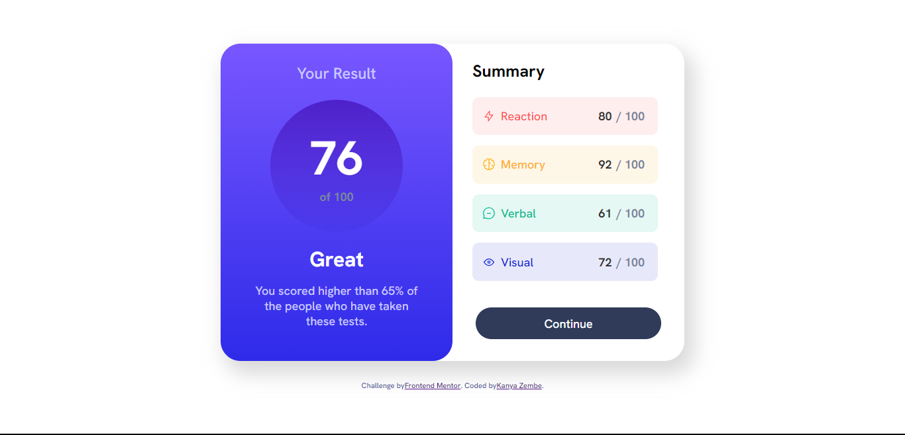

# Results summary component solution 

## Table of contents

- [Overview](#overview)
  - [The challenge](#the-challenge)
  - [Screenshot](#screenshot)
  - [Links](#links)
- [My process](#my-process)
  - [Built with](#built-with)
  - [What I learned](#what-i-learned)
  - [Continued development](#continued-development)
  - [Useful resources](#useful-resources)
- [Author](#author)
- [Acknowledgments](#acknowledgments)

## Overview
In this project I built the results-summary component using styled components, flexbox, react. I populated the content from the provided JSON data file.
### The challenge

Users should be able to:

- View the optimal layout for the interface depending on their device's screen size
- See hover and focus states for all interactive elements on the page
- **Bonus**: Use the local JSON data to dynamically populate the content

### Screenshot



### Links

- Solution URL: [Solution](https://www.frontendmentor.io/solutions/resultssummarycomponent-using-styled-com-flexbox-react-and-fetch-api-U6Mu5kgYZA)
- Live Site URL: [Live Site](https://results-summary-component-zembezn.netlify.app/)

## My process
My process was creating the components then shaping and styling them using styled components. Once the component was complete visually, I focussed on rendering and populating the data using the provided json data. I imported useState and useEffect to set up the state which I used the fetch api: async await. I passed the data into the individual components using props then mapping the data I needed. I did a bit of research on writing a fuction to calculate the average which was easy and worked out great. 
### Built with

- Semantic HTML5 markup
- Flexbox
- [React](https://reactjs.org/) - JS library
- [Styled Components](https://styled-components.com/) - For styles

### What I learned

First and foremost, I learned I am capable of way more than I ever imagined. I got comfortable with creating and styling components and learned to manipulate data to get desired outcomes. Creating state and effect was probably the most fun and interesting part of my journey creating this component. I am proud of the code I was able to write and put together, where I definately learned patience is a virtue by taking the time to understand how each element works. 

```css
export const Flex = styled.div`
display: flex;
flex-direction: column;
`
export const FlexContainer = styled.div`
display: flex;
border-radius: 30px;
box-shadow: 10px 15px 30px 5px hsla(0, 0%, 50%, 0.3);

@media (max-width: 768px) {
    flex-direction: column;
}
`

export const Result = styled.div`
max-width: 80%;
height: 12%;
display: flex;
flex-direction: row;
justify-content: space-between;
align-items: center;
background: ${({ color }) => color.at(1) };
color: ${({ color }) => color.at(0) };
border-radius: 10px;
margin: 8px 30px  ;
```
```js
  const [results, setResults] = useState([])
  
  useEffect(() => {
    const fetchResults = async () => {
      const res = await fetch("https://my-json-server.typicode.com/zembezn/results-summary-component/posts")
      const data = await res.json()
  
      setResults(data)
      }
  
    fetchResults()
  }, [])


  const Results = ( {results} ) => {

const scores = results.map((score) => { return score.score})

  function findAverage(array) {
    let average = 0;
    for (let i = 0; i < array.length; i++){
      let currentNum = array[i]
      average += currentNum;
    }
    average = average / array.length
    average = average.toFixed(0)
    return average;
  }

  const Average = findAverage(scores)


   {results.map((result) => (

        <Result key={result.id} color={result.color} >

        <Category>
          
          
          <p>{result.category}</p>
          
        </Category>
  
        <Score>
          <ResultScore>{result.score}</ResultScore>/ 100 
        </Score>
  
      </Result>

      ))}
```

### Continued development

I am interested to further develop my knowledge in the various react states and tools to add onto my tech stack. 

### Useful resources

- [Styled Components](https://css-tricks.com/dry-ing-up-styled-components/) - this helped me using styled components, understanding its dynamic and straightforward implementation.
- [Flexbox](https://css-tricks.com/snippets/css/a-guide-to-flexbox/) - this helped me undserstand what flexbox does and how it can be implemented.
- [Style Guide](https://airbnb.io/javascript/react/) - This is an amazing article on the structuring of styling files. 

## Author

- Website - [Kanya Zembe](https://github.com/zembezn)
- Frontend Mentor - [@jinxmonsoon](https://www.frontendmentor.io/profile/jinxmonsoon)

## Acknowledgments

Thank you to my friend @jamesnicholson for the guidance and support. 
